# Research: Architect-Grade Portfolio SPA Update

## Research Methodology

This document will remain objective and factual. It does not contain any recommendations or implementation suggestions.
Open questions will not ask why things haven't been built or what should be built in the future.

There is no "implementation" section — that is intentional.

## Summary

The site is a 2,225-line React 19 + Vite 6 + Tailwind v4 single page whose five sections (Hero, About, Experience, Projects, Contact) are all hard-coded JSX or inline data arrays inside their components; no CMS, router, or shared content layer exists. The Hero carries the only live "architecture showcase": three self-contained simulation cards driven by `setInterval` over the `unsData` tree, with no real MQTT. The Projects tier is two image carousels; four earlier interactive components (MQTT explorer, two UNS tree explorers, a log simulator) plus a placeholder and an MQTT hook are unreachable dead code, and because Vite tree-shakes them away the production bundle is 390 KB (122 KB gzip) with build and lint passing clean. The contact form is wired to EmailJS but no `.env` exists on disk, so every submission fails client-side before any request is sent. There are no tests, no CI, and no deploy configuration; CLAUDE.md, README.md, and docs/architecture.md each carry several stale claims, and one earlier copy plan's hard requirements were later overwritten by untracked edits.

## Question Coverage

| Question | Answered in |
|---|---|
| Q1: Story the site tells, section by section | §1, §2 |
| Q2: Design language (tokens, type, motion, theming) | §3, §4, §5 |
| Q3: Hero cards and UNS data models end to end | §6, §7 |
| Q4: Dead code, hook, and dependency state | §9, §10 |
| Q5: Projects/Demos tier composition | §8 |
| Q6: Build, quality, delivery baseline | §11, §12 |
| Q7: Docs vs code drift | §13 |
| Q8: Library capabilities at installed versions | §14 (external) |

## Findings

### 1. Every word on the page is hard-coded inside its section component

`src/App.tsx:10-25` mounts the page in fixed order: `Navbar`, then a `<main>` holding `Hero → About → Experience → Demos → Contact`, then `Footer` and `ScrollToTopButton`. There is no data layer for copy. Each section owns its text as JSX literals or a local `const` array declared above the component.

| Section | What it says (abbreviated) | Where the copy lives | Shape |
|---|---|---|---|
| Hero | "Hello! I'm" / "Ben **Duran**" / h2 "Manufacturing Software Engineer" / "I build the connective tissue between equipment data, Ignition, and MES workflows: MQTT namespaces, OEE visibility, and practical AI tools…" | `src/components/Hero.tsx:203-215` | inline JSX |
| Hero CTAs | "View Demos" → `#demos`, "Contact" → `#contact` | `Hero.tsx:217-228` | plain `<a href>` |
| About | "About Me"; bio: "I work on the systems layer where plant-floor signals become useful manufacturing context: UNS topic structures, MQTT flows, Ignition projects, MES workflows… I also use agentic AI as part of that engineering workflow…" | `src/components/About.tsx:37-45` | inline JSX |
| About skills | `'UNS Architecture','MQTT / Sparkplug B','Ignition Platform','Agentic AI','Python','TypeScript','Java','React','SQL'` | `About.tsx:51-60` | inline string array mapped to pills |
| About resume | `<a href="/resume.pdf" download>` "Download Resume" | `About.tsx:71-78` | **commented out**; nothing renders |
| Experience | "Experience" / "Work History"; 4 roles | `src/components/Experience.tsx:7-58` | `jobs: {title, dates, desc, tags: string[]}[]` |
| Projects | "Projects"; two tabs | `src/components/Demos.tsx:6-13` | `TABS: {key, label, component}[]` |
| UNS Simulator tab | "A design tool for shaping Unified Namespace topic hierarchies, configuring MQTT broker flows, and exercising realistic industrial payloads before production deployment…" | `src/components/UNSSimulatorDemo.tsx:21-30` | inline JSX + `images` array of 5 |
| Ignition Java Module tab | "A custom Java module for Ignition 8.1 that makes shared script execution visible across gateway and client contexts. It surfaces per-function timing…" | `src/components/ScriptProfilerDemo.tsx:15-23` | inline JSX + `images` array of 2 |
| Contact | "Get In Touch" / "Have a plant-floor data, Ignition, or MES challenge worth talking through? Let's connect." plus email, phone, "Richmond, VA" | `src/components/Contact.tsx:46-71` | inline JSX |
| Footer | "BD." / "Manufacturing systems, data flow, and practical delivery" / "© {year} Ben Duran · Built with React + Tailwind" | `src/components/Footer.tsx:12-20` | inline JSX |

The four Experience entries, in page order (`Experience.tsx:9-57`):

| Role | Dates | Tags |
|---|---|---|
| MES Engineer — Fortune Brands Innovations | Jan 2025 – Present · Hybrid | UNS, MQTT, Ignition, Agentic AI, Python, TypeScript, React, PostgreSQL, MES |
| Software Engineer II — Fuuz | Nov 2024 – Jan 2025 · Remote | TypeScript, React, MES, GraphQL APIs |
| MI Solutions Specialist I — GPA | Jan 2024 – Oct 2024 · Hybrid | MQTT pipelines, Ignition Perspective, OEE |
| Full Stack Developer — GPA | Jul 2022 – Jan 2024 | custom MES apps, Ignition modules, Docker |

**Architecture-level claims and their prominence.** The strongest single claim is the Fortune Brands description: "Architecting a production Unified Namespace from early design through multi-facility deployment, connecting MQTT, Ignition, and MES context while using agentic AI to accelerate delivery…" (`Experience.tsx:11`). The About bio and Hero paragraph restate the same UNS / MQTT / Ignition / MES / agentic-AI vocabulary at a glance level (`About.tsx:38-44`, `Hero.tsx:211-215`). The Projects tier makes narrower, tool-specific claims (a UNS design tool, an Ignition module) rather than enterprise-architecture claims. No section names specific tools, facility counts, tag counts, or other quantified outcomes; the words "Claude Code", "Codex", and "Copilot" appear nowhere in `src/` (see §13 for the plan that required them).

**Outbound links.** GitHub `https://github.com/benjamind10` (`Contact.tsx:81`, `Footer.tsx:26`); LinkedIn `https://www.linkedin.com/in/benjamin-duran-3a880a1b9/` with a trailing slash in Contact and without in Footer (`Contact.tsx:89`, `Footer.tsx:35`); `mailto:ben.duran@proton.me` (`Contact.tsx:97`, `Footer.tsx:44`).

**Tests:** no tests found anywhere in the repo (no `*.test.*` / `*.spec.*`, no vitest/jest/playwright in `package.json`).

### 2. Section navigation runs on react-scroll in the Navbar but on plain anchors in the Hero

The Navbar defines four links, About / Experience / Projects / Contact, mapped to ids `about`, `experience`, `demos`, `contact` (`src/components/Navbar.tsx:10-15`). Each renders a `react-scroll` `<Link smooth spy offset={-96} duration={500} activeClass=…>` (`Navbar.tsx:33-46`, mobile copy at `Navbar.tsx:80-93`); the "BD" logo is a `<Link to="hero">` with the same offset (`Navbar.tsx:21-29`). The `-96` offset compensates for the sticky `nav` (`sticky top-0 z-50 backdrop-blur`, `Navbar.tsx:18`), and each target `<section>` additionally carries `scroll-mt-24` (`About.tsx:10`, `Experience.tsx:62`, `Demos.tsx:22`, `Contact.tsx:41`); Hero has `id="hero"` without `scroll-mt-24` (`Hero.tsx:148`).

The Hero's two CTAs bypass react-scroll: they are native `<a href="#demos">` / `<a href="#contact">` (`Hero.tsx:218,224`), so they jump without the 500 ms smooth animation and rely solely on `scroll-mt-24` for header clearance. The mobile menu is a `useState` boolean toggling a hamburger/X icon and a dropdown panel (`Navbar.tsx:8,65-96`); the theme toggle appears in both desktop and mobile bars (`Navbar.tsx:47-53,58-64`).

**Tests:** no tests found.

### 3. The design system is Tailwind v4 CSS-first with an inert JS config, indigo accents, Inter, and a two-tier shadow scale

The entire global stylesheet is seven lines (`src/index.css:1-7`): `@import 'tailwindcss'`, `@custom-variant dark (&:where(.dark, .dark *))`, and a `body` rule applying `bg-white dark:bg-gray-900 text-gray-900 dark:text-white` plus `font-family: 'Inter', ui-sans-serif, system-ui, sans-serif`. There is no `@theme` block, so no project-level design tokens exist; every color, radius, and spacing value is a Tailwind default class applied inline in components.

Inter is loaded from Google Fonts via `<link rel="preconnect">` pairs and a `css2?family=Inter:wght@400;500;600;700;800&display=swap` stylesheet in `index.html:7-12`. `tailwind.config.js` exists with `darkMode: 'class'`, content globs, and an empty `theme.extend`, but nothing references it via `@config`, and Tailwind v4 does not auto-detect JS configs (see §14), so it has no effect on the build. `src/App.css` is the untouched Vite starter stylesheet (`.logo`, `.card`, `.read-the-docs`) and is imported by nothing; only `main.tsx:3` imports `index.css`.

Palette roles as used across `src/components/**`:

| Role | Classes in use | Representative locations |
|---|---|---|
| Accent | `indigo-400/500/600/700` text/bg/border, `bg-indigo-100 dark:bg-indigo-800` pills, `ring-indigo-500` focus rings | `Hero.tsx:203,219`, `About.tsx:63`, `Experience.tsx:82,95`, `Demos.tsx:36` |
| Surfaces | `white`, `gray-50/70`, `gray-100/200/300` (light); `gray-700/800/900` (dark); alternating tint `bg-gray-50/70 dark:bg-gray-800/30` on About and Demos only | `App.tsx:12`, `About.tsx:11`, `Demos.tsx:23`, `Navbar.tsx:18` |
| Status | `green-400/500` (RUNNING / sent), `yellow-400` (STOPPED), `red-400/500` (ERROR / failed), `cyan-400` (temperature readout) | `Hero.tsx:45-52`, `Contact.tsx:188,193` |
| Hard-coded hex | `#0e0f1a` card bg, `#6366f1` / `#f59e0b` / `#ef4444` OEE thresholds and SVG strokes, `#0f111a` footer bg, `#9ca3af` gauge label fill, `dark:fill-[#1f2937]` gauge track | `Hero.tsx:79,168,181,247,300,338,357,402`, `Footer.tsx:7` |

Rhythm and chrome conventions: sections use `py-16 md:py-20` with inner `max-w-6xl mx-auto px-6` (`About.tsx:13`, `Experience.tsx:63`, `Demos.tsx:25`, `Contact.tsx:42`); the shared `SectionHeader` renders an `h2` at `text-3xl md:text-4xl font-bold tracking-tight` followed by a `w-16 h-1 bg-indigo-500 rounded` divider and optional subtitle (`src/components/common/SectionHeader.tsx:14-27`). Cards are `rounded-xl` with a resting `shadow-md shadow-indigo-500/5` and hover `shadow-lg shadow-indigo-500/10` (`Experience.tsx:66`, `UNSSimulatorDemo.tsx:20`, `Contact.tsx:111`); the Hero cards and About avatar sit one tier higher at `shadow-lg shadow-indigo-500/10` and `/20` (`Hero.tsx:247,300,402`, `About.tsx:22`). Pills, avatars, and icon buttons are `rounded-full`. Interactive elements consistently carry `focus-visible:ring-2 focus-visible:ring-indigo-500 focus-visible:ring-offset-2 dark:focus-visible:ring-offset-gray-900`.

`src/utils/cn.ts:2-4` (`filter(Boolean).join(' ')`) has exactly one call site in the repo, inside dead `MQTTExplorer.tsx:121`; live components build conditional classes with template literals (`Demos.tsx:33-38`).

**Tests:** no tests found.

### 4. Dark mode is wired twice: an inline pre-hydration script and the useTheme hook, sharing only the localStorage key

`index.html:20-30` contains an inline `<script>` placed after `</body>` that reads `localStorage.getItem('theme')`, falls back to `matchMedia('(prefers-color-scheme: dark)')`, and adds or removes `.dark` on `<html>` before React loads, preventing a flash of the wrong theme. `src/hooks/useTheme.ts:4-15` re-derives the same initial value independently in a `useState` initializer, then an effect toggles `dark` / `light` classes on `document.documentElement` and writes `localStorage.setItem('theme', theme)` on every change (`useTheme.ts:17-27`). The hook's only consumer is `Navbar` (`Navbar.tsx:3,7`). The two implementations are not shared code; they agree by convention on the key `'theme'` and the values `'dark' | 'light'`.

**Tests:** no tests found.

### 5. Motion has three patterns, and reduced-motion handling covers two of them

- **Scroll-triggered reveal** goes through `FadeInWrapper` (`src/components/common/FadeInWrapper.tsx:11-35`): props `delay = 0`, `yOffset = 20`, `className`; it reads `useReducedMotion()` and, when set, starts at `{opacity: 1, y: 0}` with zero delay; otherwise `initial {opacity: 0, y: yOffset}` → `whileInView {opacity: 1, y: 0}` with `viewport {once: true, amount: 0.2}` and `transition {duration: 0.5, ease: 'easeOut'}`. Used by About, Contact, Footer.
- **Mount-time reveal** is the Hero pattern: two columns slide in from `x: ∓40` over 0.6 s with a 0.2 s stagger (`Hero.tsx:197-201,233-237`), then cards animate in with further delays. Experience uses per-item `whileInView` with `delay: index * 0.1` directly on `motion.div` (`Experience.tsx:77-80`) without consulting `useReducedMotion`.
- **Continuous / transactional** animation lives in the Hero cards (`AnimatePresence` message stream, `mode="wait"` gauge and breadcrumb swaps, `whileHover` spring lifts at `Hero.tsx:240-245,304-308,406-410`), in `ImageCarousel` (slide variants, `ImageCarousel.tsx:15-25`), and in `ScrollToTopButton` (`AnimatePresence` show/hide above 320 px, `ScrollToTopButton.tsx:5,12,30-41`).

Reduced-motion coverage: Hero computes `shouldAnimate = !prefersReducedMotion` (`Hero.tsx:109-110`) and uses it to skip the background SVG entirely (`Hero.tsx:152`), collapse transition durations to 0 (`Hero.tsx:269,334,382,426`), and stop the scroll-indicator bounce (`Hero.tsx:475`); the `setInterval` timers keep running regardless. `FadeInWrapper` is covered as above. `ScrollToTopButton`, `Experience`, and `ImageCarousel` contain no `useReducedMotion` reference; the first of these was recorded as a known deviation in `docs/reviews/visual-polish-review.md:101-105`. No `MotionConfig` wrapper exists anywhere.

**Tests:** no tests found.

### 6. The Hero cards are three independent setInterval simulations over unsData leaves, with no network and d3-shape as the only D3 import

`Hero.tsx:1-5` imports `motion, AnimatePresence, useReducedMotion` from `framer-motion`, four Lucide icons, `arc` from `d3-shape`, and `unsData, type UnsNode`. The `d3` meta-package is never imported by live code.

Module-level data: `MQTT_TOPICS` is five hard-coded ISA-95-style topics under `Enterprise/Richmond/{Press,Assembly}/…/state` (`Hero.tsx:8-14`); `STATES` and a `msgIdCounter` feed `generateMqttMessage()` which returns `{id, topic, state, temp: 60–90, cycleCount: 1000–10000, ts: HH:MM:SS}` (`Hero.tsx:36-43`). `getLeaves` flattens the `unsData` tree recursively into `OEE_NODES`, ten leaf nodes (`Hero.tsx:55-58`). `buildArcPath(value)` and `buildTrackPath()` call `arc()` with radii 32/44 over a 270° sweep from −135° (`Hero.tsx:60-76`); `oeeColor` maps ≥0.85 → `#6366f1`, ≥0.75 → `#f59e0b`, else `#ef4444` (`Hero.tsx:78-79`).

```
Hero mount                                                   (Hero.tsx:109-143)
├─ prefersReducedMotion = useReducedMotion(); shouldAnimate = !prefersReducedMotion
├─ [messages]  useState([generateMqttMessage()])
│    setInterval 2500ms → prev.slice(-2) + new message   (keeps 3 rows)
│    render: AnimatePresence initial=false inside h-[120px] overflow-hidden  (261-270)
├─ [oeeIndex]  useState(0)
│    setInterval 4000ms → (i+1) % OEE_NODES.length
│    render: gauge in w-[96px] h-[96px] wrapper, motion.svg absolute inset-0,
│            AnimatePresence mode="wait" keyed on node                       (323-357)
└─ [unsIndex]  useState(2)          // offset so it never starts on the OEE card's node
     setInterval 3500ms → (i+1) % OEE_NODES.length
     render: breadcrumb of fullPath.split('/') in relative h-5 overflow-hidden,
             motion.div absolute inset-x-0, AnimatePresence mode="wait"      (418-427)
each effect returns clearInterval
```

The fixed-height wrappers and opacity-only exits are the three layout-stability fixes from `docs/plans/hero-layout-bounce-fix.md`; all three are present at `Hero.tsx:261,268`, `323,327`, and `418,422`. The layout is `flex flex-col md:flex-row` with the card column at `max-w-xs sm:max-w-sm` (`Hero.tsx:149,234`). A grep for `hidden md:` in `Hero.tsx` returns nothing: all three cards render at every breakpoint today, whereas `docs/plans/enhanced-hero.md:315,432` and `docs/reviews/enhanced-hero-review.md:32-33` describe the OEE and UNS cards as `hidden md:block` / `hidden md:flex` on mobile. The review also left two items open: `motion.line`'s `pathLength` prop possibly no-oping on SVG `<line>` (`enhanced-hero-review.md:58`) and a then-710 KB bundle warning (`enhanced-hero-review.md:59`; see §10 for the current figure).

**Tests:** no tests found; `docs/plans/enhanced-hero.md:637-639` states verification is build + lint + manual.

### 7. Two UNS data models coexist: unsData has one live consumer, unsTree has none

```ts
// src/data/unsData.ts:1-8
export type UnsNode = {
  name: string;
  fullPath: string;
  imageUrl?: string;
  payload?: any;        // eslint-disable-line @typescript-eslint/no-explicit-any
  children?: UnsNode[];
};
```

`unsData` (`unsData.ts:10-183`) is a single rooted tree five levels deep: `Enterprise → Richmond → {Press, Assembly} → Line1..3 | Line1..2 → Machine1..2 | Station1..2`, ten leaves in total, each with `payload: {OEE, Availability, Quality, Performance}` as 0–1 floats and a `placehold.co` `imageUrl`. Every node carries a precomputed `fullPath` string.

`unsTree` (`src/data/unsTree.ts:1-22`) is an untyped `{name, children?}` literal four levels deep: `factory → line1 → machine1 | machine2 → state | infeed | outfeed`, four leaves, using lowercase names unrelated to the `Enterprise/Richmond` scheme.

| Data file | Importers | Reachable from App? |
|---|---|---|
| `unsData.ts` | `Hero.tsx:5` (live), `UNSExplorer.tsx:2-3` (dead) | yes, via Hero |
| `unsTree.ts` | `NamespaceExplorer.tsx:3` (dead) only | no |

**Tests:** no tests found.

### 8. The Projects tier is two image-carousel tabs with no tab transition, and a lightbox with no dialog semantics

`Demos.tsx:6-13` declares `TABS` with pre-instantiated elements (`component: <UNSSimulatorDemo />`), `activeTab` defaults to `'uns-sim'` (`Demos.tsx:16`), and the match is rendered as `<div>{active}</div>` (`Demos.tsx:46`) with no `AnimatePresence` or key-based transition. The file contains no references, commented or otherwise, to `NamespaceExplorer`, `LogSimulator`, `MQTTExplorer`, or `UNSExplorer`.

Both demo components pass only `images={images}` (`UNSSimulatorDemo.tsx:32`, `ScriptProfilerDemo.tsx:25`) to the shared carousel:

```ts
// src/components/common/ImageCarousel.tsx:6-13
interface CarouselImage { src: string; alt: string; }
interface ImageCarouselProps { images: CarouselImage[]; }
```

State is `index`, `direction` (±1), `modalOpen` (`ImageCarousel.tsx:28-30`); `prev` / `next` wrap modulo `images.length` (`ImageCarousel.tsx:32-40`). Slides use `custom={direction}` variants (`x: ±300` ↔ `0`, opacity) under `AnimatePresence initial={false} mode="wait"` with `duration: 0.3` (`ImageCarousel.tsx:15-25,59,69`). A "N / total" indicator renders inline and in the modal (`ImageCarousel.tsx:89-91,137-139`).

The lightbox opens on image click (`ImageCarousel.tsx:71`), renders through `createPortal(…, document.body)` (`ImageCarousel.tsx:92-93,142`), locks `document.body.style.overflow` and listens for `Escape` while open (`ImageCarousel.tsx:42-54`), closes on backdrop click with `stopPropagation` on inner controls (`ImageCarousel.tsx:101,104,110,115,133`). It has no `role="dialog"`, `aria-modal`, `aria-label`, focus movement, or focus trap; both gaps were recorded as non-blocking follow-ups in `docs/reviews/demo-image-lightbox-modal-review.md:38-44` and remain as described.

Asset usage: `src/assets/uns-sim-1..5.png` → `UNSSimulatorDemo.tsx:3-7`; `script-profiler-1..2.png` → `ScriptProfilerDemo.tsx:3-4`; `profile_pic.jpg` → `About.tsx:3`; `public/computer-chip.png` is the favicon (`index.html:5`, declared with `type="image/svg+xml"` despite being a PNG). `src/assets/react.svg` and `public/vite.svg` are referenced by nothing.

**Tests:** no tests found.

### 9. Six source files are unreachable dead code from an earlier, dark-only styling era

Reachability from `src/main.tsx → App.tsx` splits the tree as follows:

```
src/
├── main.tsx, App.tsx, index.css, vite-env.d.ts                        live
├── App.css                                                             DEAD  (Vite starter CSS, never imported)
├── components/
│   ├── Navbar, Hero, About, Experience, Demos, Contact, Footer,
│   │   ScrollToTopButton, UNSSimulatorDemo, ScriptProfilerDemo        live
│   ├── common/ SectionHeader, FadeInWrapper, ImageCarousel             live
│   ├── MQTTExplorer.tsx      159 LOC                                   DEAD
│   ├── NamespaceExplorer.tsx 105 LOC                                   DEAD
│   ├── LogSimulator.tsx       84 LOC                                   DEAD
│   ├── UNSExplorer.tsx        77 LOC                                   DEAD
│   └── Mapp.tsx               17 LOC                                   DEAD
├── hooks/ useTheme.ts (live)   useMqtt.ts 19 LOC                       DEAD
├── data/  unsData.ts (live)    unsTree.ts                              dead-only consumer
├── utils/ cn.ts                                                        dead-only consumer
└── assets/ react.svg                                                   DEAD
```

What each dead file contains:

| File | Behavior | Deps | Styling era |
|---|---|---|---|
| `MQTTExplorer.tsx` | Dual-mode: `isSimulated` toggle; simulated branch `setInterval` 2000 ms with random topic/value, capped at 50 via `slice(-49)` (`:60-66`); live branch `mqtt.connect(import.meta.env.VITE_MQTTBROKER)`, `subscribe('#')`, `JSON.parse` payloads, `client.end()` on cleanup (`:68-90`); topic list left, `JsonView` right | `mqtt`, `react-json-view-lite` + its CSS (`:3-4`), `cn` (`:5,121`) | dark-only literals (`bg-gray-900`, `text-white`), no `dark:` pairs, no `SectionHeader` |
| `UNSExplorer.tsx` | Recursive expandable tree over `unsData`; `expanded: Record<fullPath, boolean>` (`:6-13`); leaf payload as `JSON.stringify` in `<pre>` (`:44-50`); leaf `imageUrl` as `` (`:52-58`) | `unsData` | dark-only |
| `NamespaceExplorer.tsx` | `import * as d3 from 'd3'` (`:2`); `d3.hierarchy(unsTree)` + `d3.tree` laid out imperatively into an SVG ref, `selectAll('*').remove()` then re-append on every effect run (`:20-68`); `setInterval` 2000 ms highlights a random leaf; effect depends on `[highlighted]`, so each tick triggers a full redraw and restarts the interval (`:71-80`) | `d3`, `unsTree` | no `dark:` variants, plain `<div>` |
| `LogSimulator.tsx` | Fake log stream, `setInterval` 1000 ms, capped at 100, autoscroll via `requestAnimationFrame` (`:29-45`) | React only | dark-only |
| `Mapp.tsx` | Static `<section id="demos">` "Mini App Viewer" with a 🚧 placeholder paragraph (`:5-13`); duplicates the live `id="demos"` if ever rendered | none | uses `dark:` pairs |
| `hooks/useMqtt.ts` | No exports; at import time calls `mqtt.connect(VITE_MQTTBROKER, {clean, connectTimeout: 4000, reconnectPeriod: 1000})`, subscribes `'#'`, `console.log`s messages (`:3-19`) | `mqtt` | n/a |

`tsconfig.app.json:26` includes all of `src`, so these files are still type-checked and linted on every `npm run build` / `npm run lint`, and both currently pass with them present.

The ticket that orphaned them, `docs/tickets/2026-03-29_feature_demo-section-overhaul.md`, records the prior state as three tabs (UNS Explorer, MQTT Explorer, Script Profiler as a vertical image list) with five `uns-sim-*.png` assets already on disk and unused (`:56-61`), a goal of "simplify the demo section to only showcase image-based demos with a carousel UI, removing the interactive components" (`:22`), and an explicit out-of-scope note that the interactive files "can remain as dead code" (`:34`). It does not mention `NamespaceExplorer`, `LogSimulator`, `Mapp`, or `useMqtt`.

**Tests:** no tests found.

### 10. Dependency usage: dead code drags four packages, d3-shape is used but undeclared, and the shipped bundle is 390 KB

| Package | Status | Evidence |
|---|---|---|
| `react`, `react-dom`, `vite`, `@vitejs/plugin-react`, `typescript`, eslint toolchain | live | `main.tsx:1-2`, `vite.config.ts:2`, `eslint.config.js` |
| `tailwindcss`, `@tailwindcss/vite` | live | `vite.config.ts:3,7`, `index.css:1` |
| `framer-motion` | live | Hero, FadeInWrapper, ImageCarousel, ScrollToTopButton, Experience |
| `lucide-react` | live, 19 distinct icons | Contact, Footer, Experience, About, Hero, ImageCarousel, Navbar, ScrollToTopButton |
| `react-scroll` + `@types/react-scroll` | live | `Navbar.tsx:4` |
| `@emailjs/browser` | live | `Contact.tsx:3,22` |
| **`d3-shape`** | **live but undeclared** | `Hero.tsx:4` imports it directly; `package.json` lists only `d3` and `@types/d3`; it resolves because `d3-shape@3.2.0` (and `@types/d3-shape`) are transitive deps of `d3` / `@types/d3` (`package-lock.json:2756`) |
| `d3` (meta-package), `@types/d3` | dead-only | `NamespaceExplorer.tsx:2` |
| `mqtt` | dead-only | `MQTTExplorer.tsx:2`, `useMqtt.ts:1` |
| `react-json-view-lite` | dead-only | `MQTTExplorer.tsx:3-4` |
| `react18-json-view` | unused | no import anywhere in `src/` |
| `autoprefixer`, `postcss` | unused | no `postcss.config.*` exists; Tailwind runs through the Vite plugin |

Because Vite only bundles what `main.tsx` reaches, none of the dead-only packages ship. A fresh `npm ci && npm run build` at commit `b9b1098` produced:

| Output | Size | Gzip |
|---|---|---|
| `dist/assets/index-*.js` | 390.48 kB | 121.64 kB |
| `dist/assets/index-*.css` | 40.08 kB | 7.03 kB |
| `dist/index.html` | 1.10 kB | 0.57 kB |
| 7 demo PNGs + profile JPG | 12–306 kB each, 1.39 MB total | n/a |

The build emitted no chunk-size warning (the 500 kB default is not exceeded); the 710 KB figure in `docs/reviews/enhanced-hero-review.md:59` predates the removal of the interactive tabs. Everything is a single JS chunk; `vite.config.ts:6-8` sets only `plugins: [react(), tailwindcss()]` with no `manualChunks`, `base`, or `outDir`. `npm outdated` at the same moment showed every dependency behind its range's latest and several behind a major: `framer-motion` 12.12.2 → 12.43.0 (13.2.0 latest), `lucide-react` 0.511.0 → 1.41.0, `tailwindcss` 4.1.7 → 4.3.3, `vite` 6.3.5 → 6.4.3 (8.2.2 latest), `react` 19.1.0 → 19.2.8, `typescript` 5.8.3 (7.0.2 latest), `eslint` 9.27 → 9.39 (10.10 latest).

**Tests:** no tests found.

### 11. The contact form is wired to EmailJS and fails client-side on every submit because no .env exists

`Contact.tsx:8-16` holds `form = {name, email, subject, message}` and `status: 'idle' | 'sending' | 'success' | 'error'`. The only validation is HTML5 `required` on each field (`Contact.tsx:125,140,157,173`). `handleSubmit` (`Contact.tsx:18-38`) calls:

```ts
emailjs.send(
  import.meta.env.VITE_EMAILJS_SERVICE_ID,
  import.meta.env.VITE_EMAILJS_TEMPLATE_ID,
  { from_name, from_email, subject, message },
  import.meta.env.VITE_EMAILJS_PUBLIC_KEY
);
```

No `.env` or `.env.example` exists on disk; `.gitignore:26` ignores `.env`, and git history shows it was tracked until commit `4cdc496 chore: stop tracking .env file`, at which point its content was `VITE_MQTTBROKER=wss://broker.hivemq.com:8884/mqtt` plus placeholder `VITE_EMAILJS_*=your_*` values. `src/vite-env.d.ts:1` adds no `ImportMetaEnv` augmentation, so all three reads type-check as `any` and evaluate to `undefined` at runtime.

Inside the SDK (`node_modules/@emailjs/browser/es/methods/send/send.js`), `send` is an `async` function that calls `validateParams(publicKey, serviceID, templateID)` before any network I/O; that helper throws the string `'The public key is required. Visit https://dashboard.emailjs.com/admin/account'` when the key is falsy (`es/utils/validateParams/validateParams.js:2-4`). The throw becomes a rejected promise, `Contact.tsx:35-37` catches it without logging, and the UI shows "Something went wrong. Try again." (`Contact.tsx:192-196`). No HTTP request is ever made in the current configuration. On success the form would show "Message sent!" and reset (`Contact.tsx:33-34,187-191`).

The contact info block lists `ben.duran@proton.me`, `201.496.8838`, and `Richmond, VA` (`Contact.tsx:63,67,71`). The three social icon links there have no `aria-label` and no text, only an icon child (`Contact.tsx:80-101`), whereas the Footer's equivalents do carry labels (`Footer.tsx:27,36,45`). All form labels use paired `text-gray-900 dark:text-white` (`Contact.tsx:115,130,147,163`); the Subject/Message fix flagged in `docs/reviews/light-mode-colors-review.md:46-52` has landed.

**Tests:** no tests found.

### 12. Build and lint pass under strict TypeScript, but there are no tests, CI, deploy config, or SEO metadata

| Concern | State | Evidence |
|---|---|---|
| `npm run lint` | passes, zero output | fresh run at `b9b1098` |
| `npm run build` (`tsc -b && vite build`) | passes in 2.8 s, 2,154 modules | fresh run |
| TypeScript | `strict`, `noUnusedLocals`, `noUnusedParameters`, `noFallthroughCasesInSwitch`, `noUncheckedSideEffectImports`; `target ES2020`, `jsx react-jsx`; solution-style root with app/node projects | `tsconfig.app.json:4,16,19-24`, `tsconfig.json:2-6` |
| ESLint | flat config, `js` + `typescript-eslint` recommended, `react-hooks` recommended, `react-refresh/only-export-components` as warn, `dist` ignored | `eslint.config.js:8-27` |
| Prettier | `singleQuote`, `trailingComma es5`, `printWidth 80`, `tabWidth 2`, `arrowParens avoid` | `.prettierrc:1-10` |
| Tests | none: no runner, no config, no `*.test.*` | repo-wide glob |
| CI | none: no `.github/` directory | filesystem |
| Deploy | none: no `vercel.json`, `netlify.toml`, `CNAME`, `Dockerfile`, `homepage`, `gh-pages` script, or `base`; only `main` and one feature branch on the remote; no hosting URL in README or docs | `git ls-remote`, `README.md` |
| HTML shell | `lang="en"`, viewport meta, `<title>Ben Duran</title>`, favicon; **no** meta description, Open Graph, Twitter card, canonical, or manifest | `index.html:2-14` |
| Landmarks | `<nav>`, `<main>`, `<footer>`; no `aria-labelledby` on sections; no skip link; one `h1` ("Ben Duran") | `Navbar.tsx:18`, `App.tsx:14,20`, `Footer.tsx:7`, `Hero.tsx:204` |
| `aria-label`s | theme toggle, mobile menu, scroll-to-top, footer socials | `Navbar.tsx:50,61,68`, `ScrollToTopButton.tsx:38`, `Footer.tsx:27,36,45` |
| Alt text | profile photo "Ben Duran"; carousel images use data-driven `alt` ("UNS Simulator Screenshot N") | `About.tsx:25`, `ImageCarousel.tsx:63,125`, `UNSSimulatorDemo.tsx:9-15` |
| React root | `createRoot` inside `<StrictMode>` | `main.tsx:6-10` |

The repository also carries an in-repo agentic workflow toolkit that CLAUDE.md does not list: `.claude/skills/bd-{1-ticket,2-research,3-plan,4-execute,5-verify,git-commit}/SKILL.md`, `.claude/agents/*.md` (five agents), and mirrored `codex/skills/**` and `codex/agents/README.md`, all tracked in git. Its outputs are the 34 files under `docs/{tickets,research,plans,reviews}/`, described by `docs/claude-codex-cheatsheet.md`, `docs/codex-claude-mapping.md`, and `docs/codex-usage.md`, which reference only paths that exist.

**Tests:** none, as above.

### 13. CLAUDE.md, README.md, and docs/architecture.md were accurate on 2026-03-29 and have drifted since

`docs/reviews/claude-md-and-project-docs-review.md:26-34` confirms the docs matched the code when written. Later plans (EmailJS form, lightbox, visual polish) and three untracked copy commits (`5ebdfea`, `addac7f`, `d48e00c`, plus `79ec780`) did not update them.

| Claim | Where | Actual | Status |
|---|---|---|---|
| Contact form has no `onSubmit`; "does nothing" | `CLAUDE.md:46,161`; `docs/architecture.md` | `Contact.tsx:18-38,110` wires `emailjs.send` | stale |
| `.env` is committed with `VITE_MQTTBROKER` default | `CLAUDE.md:82`; `README.md:41-42,50` | untracked since `4cdc496`, absent on disk, gitignored | stale |
| Env setup documents only `VITE_MQTTBROKER` | `CLAUDE.md:80-88` | `Contact.tsx:23-31` needs three `VITE_EMAILJS_*` vars | missing from docs |
| About has a resume download link to `/resume.pdf` that 404s if missing | `CLAUDE.md:37,99,162`; `docs/architecture.md:197-199` | link is commented out (`About.tsx:71-78`); `public/resume.pdf` has never been committed | stale |
| D3 "unused/dead code currently" | `CLAUDE.md:17` | `Hero.tsx:4` uses `d3-shape` for the gauge | stale |
| `NamespaceExplorer` / `LogSimulator` "commented out in Demos.tsx" | `CLAUDE.md:44-45`; `docs/architecture.md:31-32,207-208` | `Demos.tsx` has no reference at all | stale detail |
| Directory layout / component map | `CLAUDE.md:24-65,92-106` | omit `SectionHeader.tsx`, `ScrollToTopButton.tsx`, `Mapp.tsx`, `App.css`, `react.svg`, `public/computer-chip.png`, the lightbox, `Footer` in the map | missing from docs |
| Tech stack table | `CLAUDE.md:8-20` | omits `@emailjs/browser`, `react18-json-view` | missing from docs |
| Demos contains `UNSExplorer`, `MQTTExplorer`, `ScriptProfilerDemo`; default tab `'mqtt'` | `docs/architecture.md:18-21,147` | two tabs, default `'uns-sim'` (`Demos.tsx:6-16`) | stale |
| `unsData` consumed only by `UNSExplorer` | `docs/architecture.md:111-124` | also `Hero.tsx:5` | missing from docs |
| README "Live demos include: UNS Explorer, MQTT Explorer, Script Profiler" | `README.md:5-8` | first two are dead code | stale |
| README clone URL `github.com/benjamind10/portfolio.git` | `README.md:35` | remote is `portfolio-new.git` | stale |
| Theming, `FadeInWrapper` props, section ids, styling conventions | `docs/architecture.md:36-186` | match code | accurate |

**Unreviewed plans.** `docs/plans/hero-layout-bounce-fix.md` has every item present in code (§6). `docs/plans/agentic-ai-about-and-experience-copy.md` diverges: its hard requirements that the Fortune Brands description name "Claude Code, Codex, GitHub Copilot" and carry an `Agentic Workflows` tag are not in `Experience.tsx:9-22` (the tag present is `Agentic AI`), although the plan's own execution notes (`:155-160`) record them as added. The About "Agentic AI" badge and bio mention are present (`About.tsx:38-45,54`).

**Open follow-ups recorded in reviews, still as described:** `ScrollToTopButton` ignores reduced motion (`visual-polish-review.md:101-105`); lightbox lacks focus trap and ARIA (`demo-image-lightbox-modal-review.md:38-44`); Lucide `Github` / `Linkedin` icons flagged deprecated (`ui-ux-enhancements-review.md:55`, still imported at `Contact.tsx:2`, `Footer.tsx:2`); `resume.pdf` missing (`claude-md-and-project-docs-review.md:50`).

**Tests:** no tests found; `docs/plans/visual-polish.md:440-442` states verification is manual plus build/lint.

### 14. External: what the installed library versions provide (web-sourced, not file:line)

**Framer Motion 12.12.** The project was renamed Motion; `motion/react` is the primary import and `framer-motion` remains a maintained alias republishing the same code. v12 has no breaking changes over v11 and supports React 18+. Scroll-linked APIs: `useScroll`, `useTransform`, `useSpring`, `useMotionValueEvent`, vanilla `scroll()`. `whileInView` accepts `viewport {once, amount, margin, root}`. `AnimatePresence mode` is `"sync" | "wait" | "popLayout"`. `useReducedMotion()` and `<MotionConfig reducedMotion="user">` (disables transform/layout animations, keeps opacity/color) exist. `motion.create()` replaces `motion()`; under React 19 the wrapped component receives `ref` as a plain prop. Bundle: the `motion` component alone is ~34 kB; `m` + `LazyMotion` starts at ~4.6 kB with `domAnimation` (+15 kB) or `domMax` (+25 kB) loaded on demand. Sources: https://motion.dev/docs/react-upgrade-guide, https://motion.dev/docs/react-scroll-animations, https://motion.dev/docs/react-animate-presence, https://motion.dev/docs/react-accessibility, https://motion.dev/docs/react-motion-component, https://motion.dev/docs/react-reduce-bundle-size.

**Tailwind CSS 4.1.** JS config files are not auto-detected; they load only via `@config "…"` in CSS, and `corePlugins`, `safelist`, `separator` are unsupported. Tokens are declared with `@theme { --color-*, --font-*, --spacing-*, --breakpoint-* }` and emit real CSS custom properties. Class-based dark mode is `@custom-variant dark (&:where(.dark, .dark *))`, exactly as `index.css:2`. Container queries (`@container`, `@sm:`, `@max-*`, named containers) and `@starting-style` are core since 4.0. 4.1 added `text-shadow-*`, composable `mask-*`, `wrap-break-word` / `wrap-anywhere`, colored `drop-shadow-*`, `pointer-fine` / `pointer-coarse`, `justify-center-safe`, `@source not` / `@source inline()`, and variants `details-content`, `inverted-colors`, `noscript`, `user-valid` / `user-invalid`. With `@tailwindcss/vite`, `postcss` and `autoprefixer` are not required (Lightning CSS handles prefixing). Sources: https://tailwindcss.com/docs/upgrade-guide, https://tailwindcss.com/blog/tailwindcss-v4, https://tailwindcss.com/blog/tailwindcss-v4-1.

**React 19.1.** 19.0 shipped 2024-12-05, 19.1 on 2025-03-28, 19.2 on 2025-10-01. Stable since 19.0: `use()`, `ref` as a prop (no `forwardRef`), async transitions / Actions, `useActionState`, `useOptimistic`, and native document metadata hoisting (`<title>`, `<meta>`, `<link>` rendered in components land in `<head>`). `React.lazy` + `Suspense` unchanged. Sources: https://react.dev/blog/2024/12/05/react-19, https://react.dev/versions.

**Vite 6.3.** `build.chunkSizeWarningLimit` defaults to 500 kB uncompressed. Only `VITE_`-prefixed vars reach the client; precedence is process env → `.env.[mode].local` → `.env.[mode]` → `.env.local` → `.env`. `base` rewrites asset URLs for subpath hosting (GitHub Pages); `base: './'` yields relative URLs. `public/` copies verbatim; `src/assets` imports are hashed; `?url` forces a URL import. The Environment API is experimental in 6.x. `manualChunks` under `build.rollupOptions.output` is the vendor-splitting mechanism (general Rollup documentation; Vite 6.3-specific wording unverified). Sources: https://vite.dev/config/build-options.html, https://vite.dev/guide/env-and-mode, https://vite.dev/guide/build.html.

**D3 7.9.** Official docs recommend importing from individual modules (`d3-shape`, `d3-hierarchy`, `d3-force`, `d3-zoom`) rather than the `d3` meta-package for tree-shaking; a long-standing issue documents bundlers failing to shake the umbrella import. `d3-hierarchy` provides `hierarchy`, `tree`, `cluster`, `treemap`, `pack`; `d3-shape` provides `arc`, `linkHorizontal`, etc. Approximate raw sizes: `d3-hierarchy` ~33 kB, `d3-shape` ~51 kB; full `d3` is commonly cited near 280 kB min / 85 kB gzip (exact Bundlephobia numbers unverified this session). Sources: https://d3js.org/getting-started, https://github.com/d3/d3/issues/3076, https://github.com/mermaid-js/mermaid/issues/1390.

**react-scroll 1.9.3.** Provides `Link`, `Element`, `Events`, `animateScroll`, `scrollSpy`, `scroller`. Last publish 2023-10-06; Socket flags an unhealthy release cadence and single maintainer; no React 19 compatibility statement exists (the current build passes with it under React 19.1, per §12). Native equivalents are CSS `scroll-behavior: smooth`, `scroll-margin-top`, and `IntersectionObserver`, all baseline in evergreen browsers (MDN matrix not fetched this session). Sources: https://www.npmjs.com/package/react-scroll, https://socket.dev/npm/package/react-scroll.

**mqtt.js 5.13.** Browsers support only `ws://` / `wss://`; since 5.2 `import mqtt from 'mqtt'` resolves the browser ESM build; 5.3 optimized browser bundles. Vite does not polyfill Node built-ins, and community guidance describes `rollup-plugin-polyfill-node`-style workarounds when needed. HiveMQ's shared public broker is documented as public with no SLA and "not for production data". A live probe from this machine on 2026-09-04 using the installed `mqtt@5.13.0` confirmed both public endpoints accept WebSocket-TLS connections: `wss://broker.hivemq.com:8884/mqtt` (the value the old `.env` carried) connected in 660 ms and `wss://test.mosquitto.org:8081/mqtt` in 1,761 ms. Sources: https://github.com/mqttjs/mqtt.js/, https://github.com/mqttjs/MQTT.js/releases/tag/v5.3.0, https://www.hivemq.com/mqtt/public-mqtt-broker/.

**lucide-react 0.511.** ESM per-icon exports are tree-shaken in production builds; Vite dev mode does not tree-shake, so barrel imports slow the dev server, with per-icon path imports as the documented workaround. Lucide released v1.0 (brand icons removed, smaller bundles); current npm latest is 1.4x. Sources: https://lucide.dev/guide/packages/lucide-react, https://www.infoq.com/news/2026/06/lucide-v1-icons/.

**EmailJS browser SDK 4.4.1.** `send(serviceID, templateID, templateParams, options?)` where `options.publicKey` overrides `init({publicKey, blockHeadless, blockList, limitRate})`; returns `{status, text}`. Local SDK source confirms the pre-flight validation and thrown message described in §11. EmailJS states an exposed public key only lets a caller trigger the account's own templates. Free tier: 200 requests/month, 2 templates, 50 KB request cap, 7-day history, no attachments. Sources: https://www.emailjs.com/docs/sdk/send/, https://www.emailjs.com/docs/sdk/init/, https://www.emailjs.com/docs/faq/is-it-okay-to-expose-my-public-key/, https://www.emailjs.com/pricing/.

## Architecture

```mermaid
flowchart TB
  subgraph shell["index.html"]
    fouc["inline theme script<br/>(reads localStorage 'theme')"]
    fonts["Google Fonts: Inter"]
  end
  main["main.tsx<br/>StrictMode + createRoot"] --> App["App.tsx"]
  main --> css["index.css<br/>@import tailwindcss<br/>@custom-variant dark"]
  App --> Navbar
  App --> Hero
  App --> About
  App --> Experience
  App --> Demos
  App --> Contact
  App --> Footer
  App --> STT["ScrollToTopButton"]

  Navbar --> useTheme["hooks/useTheme.ts"] -->|"classList dark/light<br/>localStorage 'theme'"| html["document.documentElement"]
  fouc -.->|"same key, separate code"| html
  Navbar -->|"Link smooth spy offset -96"| rs["react-scroll"]

  Hero -->|"arc()"| d3s["d3-shape (transitive via d3)"]
  Hero -->|"getLeaves → 10 leaves"| unsData["data/unsData.ts"]
  Hero -->|"3 × setInterval<br/>2500 / 4000 / 3500 ms"| cards["MQTT stream · OEE gauge · UNS path"]

  About --> FIW["common/FadeInWrapper"]
  Contact --> FIW
  Footer --> FIW
  About --> SH["common/SectionHeader"]
  Experience --> SH
  Demos --> SH
  Contact --> SH

  Demos -->|"TABS[0]"| UNSSim["UNSSimulatorDemo<br/>5 PNGs"]
  Demos -->|"TABS[1]"| Prof["ScriptProfilerDemo<br/>2 PNGs"]
  UNSSim --> IC["common/ImageCarousel<br/>slides + portal lightbox"]
  Prof --> IC

  Contact -->|"emailjs.send(undefined×3)<br/>→ throws pre-network"| ejs["@emailjs/browser"]

  subgraph dead["Unreachable from App"]
    MQTTX["MQTTExplorer"] --> mqtt["mqtt"]
    MQTTX --> rjvl["react-json-view-lite"]
    MQTTX --> cn["utils/cn.ts"]
    UNSX["UNSExplorer"] --> unsData
    NSX["NamespaceExplorer"] --> d3["d3 (full)"]
    NSX --> unsTree["data/unsTree.ts"]
    LogSim["LogSimulator"]
    Mapp
    useMqtt["hooks/useMqtt.ts"] --> mqtt
    AppCss["App.css"]
  end
```



The live graph is shallow: `App` fans out to eight siblings, three shared primitives are reused across sections, and the only data file in play is `unsData`, consumed solely by Hero. There is no shared state, context, or router; cross-section coupling exists only through DOM ids (`hero`, `about`, `experience`, `demos`, `contact`) that react-scroll and the Hero anchors target. Everything in the dead subgraph is still compiled and linted (`tsconfig.app.json` includes all of `src`) but excluded from the bundle.

## Code References

### Page shell and entry
- `index.html:1-32` — HTML shell, favicon, Inter font links, `<title>`, inline pre-hydration theme script (exhaustive)
- `src/main.tsx:1-10` — `createRoot` under `StrictMode`, imports `index.css`
- `src/App.tsx:10-25` — section order and root wrapper classes
- `src/index.css:1-7` — the entire global stylesheet
- `src/App.css` — unimported Vite starter CSS
- `tailwind.config.js` — present, not loaded (no `@config`)

### Live sections (exhaustive for `src/components/`)
- `src/components/Navbar.tsx:10-15,18-53,65-96` — links array, react-scroll `Link`s, theme toggle, mobile menu
- `src/components/Hero.tsx:8-14,36-79,109-143,148-152,197-237,240-468,475-484` — topics, helpers, timers, layout, copy, three cards, scroll indicator
- `src/components/About.tsx:10-13,22-25,37-45,51-60,71-78` — section wrapper, avatar, bio, skills, commented resume link
- `src/components/Experience.tsx:7-58,62-66,73-103` — `jobs` array, wrapper, timeline render with `whileInView`
- `src/components/Demos.tsx:6-13,16-18,22-46` — `TABS`, state, tab buttons, active render
- `src/components/UNSSimulatorDemo.tsx:3-7,9-15,20-32` — image imports, alt texts, copy, carousel
- `src/components/ScriptProfilerDemo.tsx:3-4,6-9,15-25` — same pattern, two images
- `src/components/Contact.tsx:8-38,46-71,80-101,110-196` — state, submit handler, info block, unlabeled socials, form and status UI
- `src/components/Footer.tsx:7-20,26-45` — footer copy and labeled socials
- `src/components/ScrollToTopButton.tsx:5,12,30-41` — threshold, `AnimatePresence`, no reduced-motion check

### Shared primitives (exhaustive for `src/components/common/`)
- `src/components/common/SectionHeader.tsx:3-7,14-27` — props and render
- `src/components/common/FadeInWrapper.tsx:4-9,17-35` — props, reduced-motion gate, `whileInView` config
- `src/components/common/ImageCarousel.tsx:6-13,15-25,28-54,59-71,89-93,101-143` — types, variants, state, effects, inline slide, lightbox portal

### Hooks, data, utils (exhaustive)
- `src/hooks/useTheme.ts:4-31` — init from storage/media query, class + storage effect, `toggle`
- `src/hooks/useMqtt.ts:1-19` — dead; module-scope `mqtt.connect`
- `src/data/unsData.ts:1-8,10-183` — `UnsNode` type, ten-leaf tree
- `src/data/unsTree.ts:1-22` — dead-only `{name, children}` tree
- `src/utils/cn.ts:2-4` — dead-only classname join

### Dead components
- `src/components/MQTTExplorer.tsx:3-5,53-55,57,60-66,68-90,121-124,145` — imports, state, simulated and live branches, `cn` call, `JsonView`
- `src/components/UNSExplorer.tsx:2-3,6-13,44-58` — data import, expand state, leaf render
- `src/components/NamespaceExplorer.tsx:2-3,20-24,25-68,71-80` — `d3` import, hierarchy/tree, imperative redraw, interval
- `src/components/LogSimulator.tsx:29-45` — state cap and interval
- `src/components/Mapp.tsx:5-13` — placeholder section with duplicate `id="demos"`

### Build, lint, config (exhaustive)
- `package.json:6-11,12-42` — scripts, dependencies, devDependencies
- `package-lock.json:2756` — `d3-shape@3.2.0` transitive entry
- `vite.config.ts:6-8` — plugins only
- `tsconfig.json:2-6`, `tsconfig.app.json:4,16,19-26`, `tsconfig.node.json:4,17-22` — project references and strict flags
- `eslint.config.js:8-27` — flat config
- `.prettierrc:1-10`, `.gitignore:10-11,26` — formatting, ignored `.env` / `dist` / `node_modules`
- `src/vite-env.d.ts:1` — no env typing

### Assets
- `src/assets/` — `profile_pic.jpg`, `uns-sim-1..5.png`, `script-profiler-1..2.png` (live); `react.svg` (unreferenced)
- `public/` — `computer-chip.png` (favicon), `vite.svg` (unreferenced); no `resume.pdf`

### Documentation and in-repo workflow tooling
- `CLAUDE.md:8-20,24-65,80-88,92-106,158-163` — tech stack, layout, env, component map, gotchas (drift in §13)
- `README.md:5-8,35,41-50,68-80` — live-demo list, clone URL, `.env` claim, structure (drift in §13)
- `docs/architecture.md:18-21,31-32,111-124,147,197-208` — component tree, dead-code inventory, data flows (drift in §13)
- `docs/tickets/`, `docs/research/`, `docs/plans/`, `docs/reviews/` — 34 files across the 2026-03-29 and 2026-04-05 rounds (key files cited inline; others in these dirs are relevant history)
- `docs/claude-codex-cheatsheet.md`, `docs/codex-claude-mapping.md`, `docs/codex-usage.md` — describe the in-repo workflow wrappers
- `.claude/skills/bd-*/SKILL.md`, `.claude/agents/*.md`, `codex/skills/**`, `codex/agents/README.md` — tracked five-step ticket→research→plan→execute→verify toolkit

## Historical Context (from thoughts/)

`thoughts/` contains only this task's folder; there is no prior art there. The equivalent record lives in `docs/` from two earlier rounds run with the in-repo toolkit above. Decisions still reflected in code:

- `docs/tickets/2026-03-29_feature_demo-section-overhaul.md:22,34` — replaced three interactive tabs with two image carousels; explicitly left the interactive components as dead code. Code matches.
- `docs/plans/enhanced-hero.md` + `docs/reviews/enhanced-hero-review.md` — built the three simulation cards with `d3-shape`; code matches except the mobile `hidden md:*` classes described there are absent today (§6).
- `docs/plans/hero-layout-bounce-fix.md` — fixed-height wrappers and opacity-only exits; all present (§6). No review file exists.
- `docs/plans/agentic-ai-about-and-experience-copy.md` — About and Experience copy for agentic AI; About items present, Experience hard requirements later overwritten (§13). No review file exists.
- `docs/plans/visual-polish.md` + review — Inter, two-tier shadows, alternating tints, `focus-visible` rings, `SectionHeader`, `ScrollToTopButton`; code matches, with the review's five recorded deviations still in place (§5, §13).
- `docs/plans/demo-image-lightbox-modal.md` + review — portal lightbox; ARIA and focus-trap follow-ups still open (§8).
- `docs/plans/light-mode-colors.md` + review — light-mode pairing; the flagged Subject/Message label miss has since landed (§11).
- `docs/plans/claude-md-and-project-docs.md` + review — authored CLAUDE.md, README, architecture.md on 2026-03-29; not updated since (§13).

## Discovered Unknowns

- `d3-shape` is imported by live code but not declared in `package.json`; it resolves only as a transitive dependency of `d3`, which is itself used only by dead code.
- All three Hero cards render on mobile; the plan and review that built them describe two of the cards as hidden below `md`, and no commit or doc records the change.
- The Fortune Brands experience copy no longer contains the tool names and `Agentic Workflows` tag its plan listed as hard requirements; four later copy-only commits have no ticket, plan, or review.
- `Mapp.tsx` reuses `id="demos"`, which would collide with `Demos.tsx` if both were ever mounted.
- `src/App.css` still ships in the repo unimported, and `public/vite.svg` / `src/assets/react.svg` are unreferenced starter files.
- The favicon `<link>` declares `type="image/svg+xml"` for a PNG.
- Contact's three social icon links have no accessible name; Footer's equivalents do.
- The LinkedIn URL differs by a trailing slash between Contact and Footer.
- `react-scroll` has had no release since October 2023 and no stated React 19 support, yet builds and type-checks under React 19.1 here.
- The production bundle is 390 KB, not the 710 KB recorded in the last review; the difference is the tree-shaken interactive tabs.
- The repository contains a tracked, five-step `.claude/skills` + `codex/` workflow toolkit and 34 generated docs that CLAUDE.md never mentions.
- `.env` was tracked in git through commit `4cdc496` with placeholder EmailJS values; its removal is why the form now fails.

## Open Questions

- Where is the site currently hosted, if anywhere? Nothing in the repo, remote branches, or docs names a hosting target or URL; only the owner can answer.
- Does `motion.line`'s `pathLength` animation actually take effect on the Hero's background SVG `<line>` elements? Flagged in `docs/reviews/enhanced-hero-review.md:58`, never verified in a browser.
