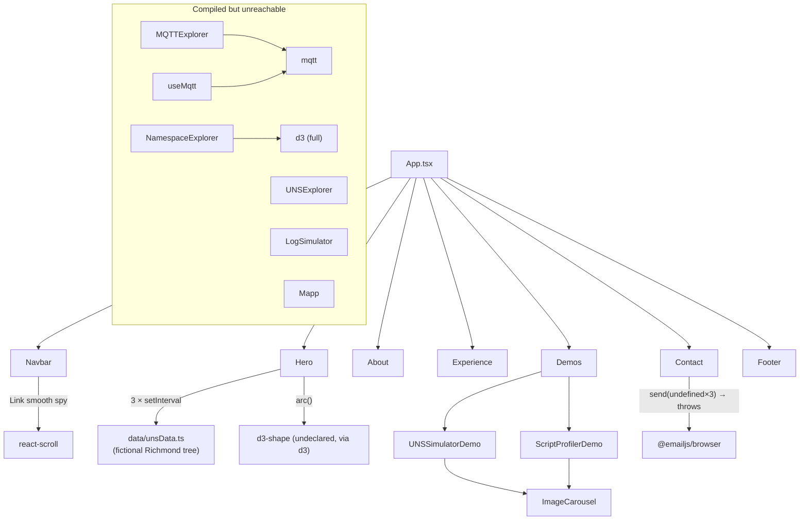
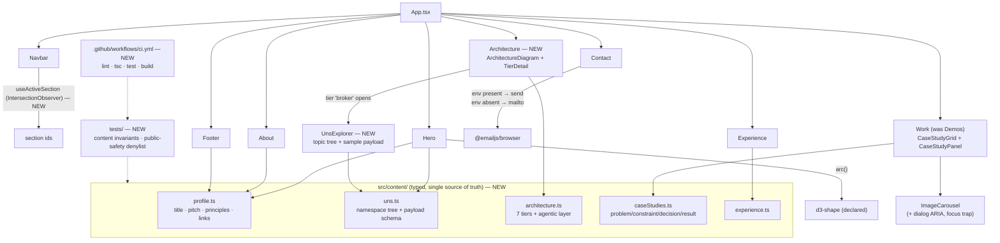

# Design: Architect-Grade Portfolio SPA Update

## Summary of Change Request

Ben asked for a "banger" update to his portfolio SPA with nothing out of scope, built on everything known about him, whose one job is to make a reader understand how good an architect he is. The ticket is intent, not a spec: the site today says "Manufacturing Software Engineer" and shows two screenshot carousels, while the record (`thoughts/tasks/2026-09-04-ben-duran-briefing.md`) shows a seven-tier production UNS, a multi-agent reporting DAG, a semantic layer built for machine consumers, and a three-seat career arc. The gap between what he has done and what the site says is the whole task.

## Current State

The site is a flat, hard-coded, five-section page. Every word of copy is a JSX literal or a local `const` inside its own component (`Hero.tsx:203-215`, `About.tsx:37-60`, `Experience.tsx:7-58`, `Demos.tsx:6-13`); there is no content layer, so consistency depends on hand-editing five files. The one place the page "shows architecture" is the Hero's three simulation cards, driven by three `setInterval`s over the ten `unsData` leaves (`Hero.tsx:113-144`) under a fictional `Enterprise/Richmond/...` namespace (`Hero.tsx:8-14`, `unsData.ts:10-183`). The Projects tier (`Demos.tsx`) is two image carousels making tool-level claims, not architecture claims.

Structurally the repo undercuts the pitch: six unreachable files from a dark-only era (`MQTTExplorer`, `UNSExplorer`, `NamespaceExplorer`, `LogSimulator`, `Mapp`, `useMqtt`) plus `App.css`, `unsTree.ts`, and starter SVGs are still compiled and linted; four packages exist only for that dead code (`mqtt`, `react-json-view-lite`, `react18-json-view`, `d3`) while the live `d3-shape` import at `Hero.tsx:4` is undeclared; `tailwind.config.js` is inert under Tailwind v4; `react-scroll` is a stale single-maintainer dep the Hero CTAs don't even use (`Hero.tsx:218,224`). The contact form is wired to EmailJS but throws pre-network because no `.env` exists (`Contact.tsx:22-31`); the resume button is commented out (`About.tsx:71-78`); there are no tests, no CI, no deploy config, no meta description, and three docs (`CLAUDE.md`, `README.md`, `docs/architecture.md`) contradict the code.

What is worth keeping is real: a disciplined Tailwind v4 dark-mode setup (`index.css:1-7`, `index.html:20-30`), a coherent indigo/Inter visual language with a two-tier shadow scale, three good shared primitives (`SectionHeader`, `FadeInWrapper`, `ImageCarousel`), reduced-motion awareness in Hero and `FadeInWrapper`, and the Hero's fixed-height layout-stability fixes (`Hero.tsx:261,323,418`).

## Desired End State

A reader who scrolls once leaves knowing three things: Ben designs multi-tier production data architectures, he designs them so that non-human consumers can reason over them, and he has seen the problem from the integrator, vendor, and manufacturer seats. Concretely:

- The Hero claims the architect role and its three cards run on the **same namespace model** the rest of the page explains, so the "demo" and the "explanation" are visibly one system.
- A new **Architecture** section is the centerpiece: an interactive seven-tier reference architecture (edge transport → broker with schema-validated rules → MES context on Ignition → analytics enrichment → historian → cloud warehouse → governed API egress) with the agentic layer (MCP servers, semantic layer, multi-agent DAG) drawn against it. Clicking a tier explains what it does, why it is a separate tier, and what decision it encodes.
- **Projects** becomes **Work**: case studies in a Problem → Constraint → Decision → Result shape, each carrying the real numbers the record supports (6 extrusion lines, 3 plants on 2 MES stacks, 25 event schemes cleared, 11 instances × 47 concepts, 8 services per site, 6 MCP connections, a five-stage agent DAG). The two screenshot demos survive as two of the case studies.
- **Experience** tells the three-seat arc explicitly; **About** carries a short list of operating principles lifted from evidence (enforce contracts at the edge, design for non-human consumers, remove your own workarounds, persist every decision).
- The repo itself reads like an architect's: typed content layer, zero dead code, declared deps only, native scroll (no `react-scroll`), design tokens in `@theme`, a public-safety test that fails the build if an internal hostname or colleague name leaks, GitHub Actions running lint + typecheck + test + build, and docs that match.
- Contact degrades gracefully: with EmailJS env present the form sends; without it the form renders a mailto CTA instead of a button that always fails.

Verification is `npm run lint && npm run test && npm run build` green, bundle under the 500 KB warning, and a manual pass in light/dark at 375px and 1280px with `prefers-reduced-motion` on and off.

## Architecture: Before → After

Before:

After:

## Approach

**One namespace model drives everything.** Promote `unsData.ts` into `src/content/uns.ts` with a real `UnsPayload` type (no `any`, `unsData.ts:6`) and let Hero cards, the Architecture section's broker detail, and the case studies all read it. The coherence is the architecture lesson: when the reader sees the same topic path in the Hero ticker and in the explorer, the site is demonstrating a UNS rather than describing one.

**Content moves out of JSX into `src/content/*.ts`.** Follow the shape `Experience.tsx:7-58` already uses (a typed local array mapped in render), but hoist each array into its own module with an exported interface. Components become pure renderers. This is what makes a public-safety test possible: tests import the content modules and assert against a denylist.

**The Architecture section is hand-laid React + Framer Motion, not D3.** Seven tier cards in a CSS grid, connectors as inline SVG paths, `layoutId` transitions into a detail panel. D3-in-React is the imperative pattern that died in `NamespaceExplorer.tsx:20-68`; the only D3 the site needs is `arc()` for the gauge. Motion follows the mount-triggered Hero pattern (`Hero.tsx:197-201`) for the diagram and `FadeInWrapper` for prose.

**Work replaces Demos, keeping `ImageCarousel`.** Case studies render as a grid of cards; selecting one expands an inline panel (no router). Screenshot-backed studies (UNS Simulator, Script Profiler) embed the existing carousel; text-only studies embed a small diagram (the agent DAG as five chevron stages; the OEE defect as a before/after timeline). `Demos.tsx`'s pre-instantiated `TABS` array (`Demos.tsx:6-13`) goes away.

**Navigation goes native.** `scroll-behavior: smooth` on `html`, existing `scroll-mt-24`, and a `useActiveSection` hook over `IntersectionObserver` replace `react-scroll` in `Navbar.tsx:33-46,80-93`; Hero CTAs (`Hero.tsx:218,224`) then behave identically to nav links for free.

**Quality gates are real but small.** Vitest + Testing Library, three test files: content invariants (every case study has all four narrative fields and at least one metric), public-safety denylist (internal hostnames, DB names, colleague and manager names, site codes must not appear anywhere in `src/content`), and one render smoke test per section. GitHub Actions runs lint, `tsc -b`, tests, build on push and PR.

**Load-bearing patterns to preserve:** section wrapper `max-w-6xl mx-auto px-6 py-16 md:py-20` with `SectionHeader` (`About.tsx:13-16`); paired light/dark classes everywhere (`Experience.tsx:84-95`); `focus-visible` ring recipe (`Navbar.tsx:42`); reduced-motion gating as in `Hero.tsx:109-110` — promote it to a root `<MotionConfig reducedMotion="user">` so `Experience`, `ScrollToTopButton`, and `ImageCarousel` inherit it.

## Decisions

### D1: What the Hero claims
**Status:** Resolved
**Decision:** The Hero h2 reads "Manufacturing Systems Architect · Unified Namespace, MES, Agentic AI" as positioning; Experience keeps the literal employer title ("MES Engineer — Fortune Brands Innovations", `Experience.tsx:9`) as record. The pitch line leads with designing the data models that make automated reasoning possible, never with "uses AI to code faster." Copy lives in `profile.ts`.
**Alternatives:** Keep "MES Engineer" everywhere (undersells, leaves the ticket unmet); use an architect title everywhere including Experience (publishes a title the employer did not grant).
**Rationale:** Positioning and record stay distinct, which sidesteps the title drift the briefing flagged while still putting "architect" above the fold. Approved as recommended on 2026-09-04. Condition: Ben confirms his current employer title before Experience copy is final.

### D2: Public-specificity policy for employer detail
**Status:** Resolved
**Decision:** Tiers 1 and 2 are on: technologies and vendors (EMQX, Ignition, Flow Software, Canary/Timebase, Snowflake, FastAPI, Sparkplug B) and scale counts (3 plants in 3 states, 2 MES stacks, 6 extrusion lines, 25 event schemes, 11 instances × 47 concepts, 8 services per site, 6 MCP connections). Tier 3, business-unit brand names, is off: copy says "three plants in three states", never the three brand names (redacted here too; the site never publishes them). Tier 4 is never: hostnames, site codes, database names, Flow object IDs, colleague and manager names, enforced by the denylist test in D9. The Hero/explorer namespace stays fictional but ISA-95-realistic, renamed from `Enterprise/Richmond/...` to a shape like `Enterprise/Plant-A/Extrusion/Line19/Extruder/...`.
**Alternatives:** Naming brands (more credibility, invites an HR question nobody has asked); naming nothing (reads generic).
**Rationale:** Counts prove scale without identifying anything; the denylist makes the policy a build failure rather than a review note. Approved as recommended on 2026-09-04.

### D3: Section order and new sections
**Status:** Resolved
**Decision:** Page order is Hero → Architecture → Work → Experience → About (with a Principles list) → Contact → Footer. Nav is Architecture · Work · Experience · About · Contact. Section ids: `hero`, `architecture`, `work`, `experience`, `about`, `contact`; the old `demos` id is retired.
**Alternatives:** About second (conventional; buries the proof); Principles as its own section (one more scroll stop for four lines).
**Rationale:** Proof before biography matches the ticket's success metric and the briefing's pitch order. Approved as recommended on 2026-09-04.

### D4: How the Architecture section is built
**Status:** Resolved
**Decision:** Hand-laid React: seven tier cards in a CSS grid, inline SVG connectors, a Framer `layoutId` detail panel, all data from `architecture.ts`. The agentic layer (MCP servers, semantic layer, multi-agent DAG) is drawn alongside the tiers as a consumer of tiers 4–7. The broker tier's detail embeds a small `UnsExplorer` (expandable topic tree, sample payload, the schema rule that validates it) reading `uns.ts`.
**Alternatives:** Static diagram image (fast, not themeable, reads as a slide); `d3-hierarchy`/force layout (re-introduces the imperative pattern removed with `NamespaceExplorer.tsx` and drags `d3` back).
**Rationale:** The centerpiece should behave like software, not a picture of software, and it reuses the motion vocabulary already on the page. Approved as recommended on 2026-09-04.

### D5: Which case studies, in what shape
**Status:** Resolved
**Decision:** Six studies in `caseStudies.ts`, each `{problem, constraint, decision, result, metrics[], tags[], media?}`, in this order: (1) seven-tier production UNS reference architecture; (2) multi-agent production reporting pipeline as a typed-handoff DAG, with the ticket → research → plan → execute → verify workflow described inside it as "how it was built"; (3) semantic layer for machine consumption (11 instances × 47 concepts, packaged as a reusable generator); (4) OEE data-model forensics (timestamp inversion producing Availability above 100 %, duplicate bindings from template redeployment cascades, 25 event schemes unblocked); (5) UNS Simulator (existing 5 screenshots); (6) Ignition Gateway Script Profiler module (existing 2 screenshots). Studies 1–4 are text plus a small inline diagram; 5–6 embed `ImageCarousel`. Rendered as a card grid with an inline expanding panel.
**Alternatives:** Fewer studies (thinner proof); tabs (hide five of six by default); a separate "workflow toolkit" study (meta-tooling; folded into study 2 instead).
**Rationale:** Each new study is an architect-tier claim the record supports; the two demos become supporting evidence rather than the headline. Approved as recommended on 2026-09-04.

### D6: Typed content layer
**Status:** Resolved
**Decision:** All copy moves into `src/content/{profile,uns,architecture,caseStudies,experience}.ts` with exported interfaces; `unsData.ts` is promoted into `uns.ts` with a real `UnsPayload` type replacing the `any` at `unsData.ts:6`. Components render only.
**Alternatives:** Inline JSX (fastest; un-testable, copy scattered across six files); markdown/MDX pipeline (a build dependency for five files of content).
**Rationale:** Precondition for the denylist test, keeps six sections consistent, and models the discipline the site claims. Approved as recommended on 2026-09-04.

### D7: Dead-code and dependency purge, including react-scroll
**Status:** Resolved
**Decision:** Delete `MQTTExplorer.tsx`, `UNSExplorer.tsx`, `NamespaceExplorer.tsx`, `LogSimulator.tsx`, `Mapp.tsx`, `hooks/useMqtt.ts`, `App.css`, `data/unsTree.ts`, `assets/react.svg`, `public/vite.svg`, `tailwind.config.js`. Drop `mqtt`, `react-json-view-lite`, `react18-json-view`, `d3`, `@types/d3`, `autoprefixer`, `postcss`, `react-scroll`, `@types/react-scroll`. Add `d3-shape` and `@types/d3-shape` explicitly. Replace react-scroll with `scroll-behavior: smooth`, the existing `scroll-mt-24`, and a `useActiveSection` hook over `IntersectionObserver`. `utils/cn.ts` stays and becomes the conditional-class helper for the new components. Live MQTT is not coming back; the simulated explorer in D4 covers the intent.
**Alternatives:** Keep the interactive components for later (the 2026-03-29 ticket's choice; they are dark-only and pre-`SectionHeader`, so reviving them is a rewrite anyway).
**Rationale:** A portfolio arguing for architectural discipline cannot ship a repo that type-checks 440 lines of unreachable code. Approved as recommended on 2026-09-04.

### D8: Contact form, resume, and phone number
**Status:** Resolved
**Decision:** Form: type `ImportMetaEnv` in `vite-env.d.ts`, add `.env.example` with the three `VITE_EMAILJS_*` keys, and render a mailto CTA in place of the form when any key is missing at build time. Resume: the `About.tsx:71-78` download button is re-enabled and `public/resume.pdf` becomes a required deliverable from Ben; if the PDF is not supplied before PR, the button is removed rather than left 404ing. Phone: the personal number at `Contact.tsx:67` is removed; email and LinkedIn remain.
**Alternatives:** Remove the form entirely (simpler; loses "sends without exposing an address"); keep the phone.
**Rationale:** The site never ships a control that always fails, and never publishes a personal phone number. Approved as recommended on 2026-09-04. Conditions: Ben supplies `public/resume.pdf` and, if the form should send in production, the EmailJS credentials in the hosting environment.

### D9: Quality gates and deploy
**Status:** Resolved
**Decision:** Add Vitest + Testing Library with three test files: content invariants (every case study has all four narrative fields and at least one metric; every tier has a name, purpose, and decision), a public-safety denylist over everything in `src/content` (hostnames, site codes, database names, Flow object IDs, colleague and manager names), and a render smoke test per section. Add `.github/workflows/ci.yml` running lint, `tsc -b`, test, and build on push and pull request. Add meta description, Open Graph, and Twitter card tags to `index.html` and fix the favicon `type`. Deploy automation and the canonical URL are deferred until the hosting target is known; `vite.config.ts` gains `base` only if that answer is GitHub Pages.
**Alternatives:** No tests (status quo; the denylist guarantee disappears); Playwright visual tests (over-scoped for a static page).
**Rationale:** CI and a public-safety test are cheap and are exactly the guardrail the case studies say he builds. Approved as recommended on 2026-09-04. Condition: Ben names the hosting target before deploy automation is added.

### D10: Design tokens and type
**Status:** Resolved
**Decision:** Add an `@theme` block in `index.css` for accent, surface, status, and gauge colors, replacing the hard-coded hex at `Hero.tsx:79,168,181,338,357` and `Footer.tsx:7`. Load JetBrains Mono alongside Inter from Google Fonts and map it to `--font-mono` for the terminal and namespace elements the Hero already sets in `font-mono`. Keep indigo, Inter, the two-tier shadow scale, and the section rhythm unchanged. Wrap the app in `<MotionConfig reducedMotion="user">` so every animated component honors the preference.
**Alternatives:** Full restyle (a "new coat of paint" reading that distracts from the proof); no tokens (leaves six hex literals and an inert config).
**Rationale:** Tokens are the Tailwind v4 idiom the current config pretends to use; a mono face makes the industrial data elements read as intentional. Approved as recommended on 2026-09-04.

## Uncertainties

Each item below is either owed by Ben (listed as an Approval condition) or accepted as a known risk.

- **Current employer title** (D1). Owed by Ben before Experience copy is final; the Hero positioning does not depend on it.
- **Employer comfort with public detail** (D2). Accepted risk: nothing here has HR review, but with brand names off and the denylist enforced, the page names only technologies, vendors, and counts.
- **No quantified business outcomes exist in the record.** Accepted: every available metric is an engineering count and the case studies say so honestly. If Ben later has hours-saved or OEE-point figures they slot into studies 2 and 4 without structural change.
- **Hosting target and canonical URL** (D9). Owed by Ben; deploy automation and the OG `url` tag wait on it, everything else ships.
- **Resume PDF and EmailJS credentials** (D8). Owed by Ben; the design degrades gracefully without both.
- **Public repos for the Java module and UNS simulator.** Accepted: studies 5–6 stay screenshot-only unless Ben supplies links.
- **Bundle growth.** Accepted: six content modules and an SVG diagram should stay well under 500 KB; if the build warns, `React.lazy` the Architecture section.
- **Mobile Hero cards.** Accepted as-is: all three keep rendering below `md`, as they do today.
- **`motion.line pathLength`** on the Hero background may be a no-op (research Open Question 2). Accepted: verify in-browser during implementation, harmless either way.

## What We're NOT Doing

- No router, no CMS, no backend, no live MQTT connection.
- No new visual identity beyond tokens and a mono face.
- No blog, no talks page, no analytics.
- No internal hostnames, site codes, database names, object IDs, or colleague/manager names, ever.

## Approval

Approved by the user on 2026-09-04 ("approve all your recommendations as a first pass"). All ten decisions resolved on their recommended option.

Conditions (inputs Ben owes; none block structure or implementation start):
1. Confirm current employer title for the Experience entry (D1).
2. Supply `public/resume.pdf`, or the download button is removed before PR (D8).
3. Supply EmailJS credentials in the hosting environment if the contact form should send in production; otherwise the mailto fallback ships (D8).
4. Name the hosting target so deploy automation and the canonical URL can be added (D9).
